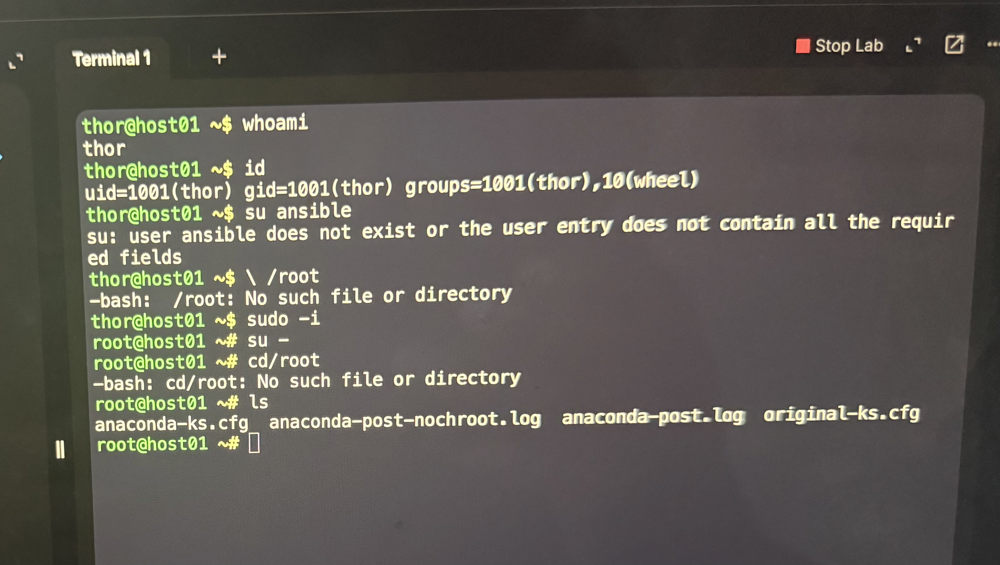
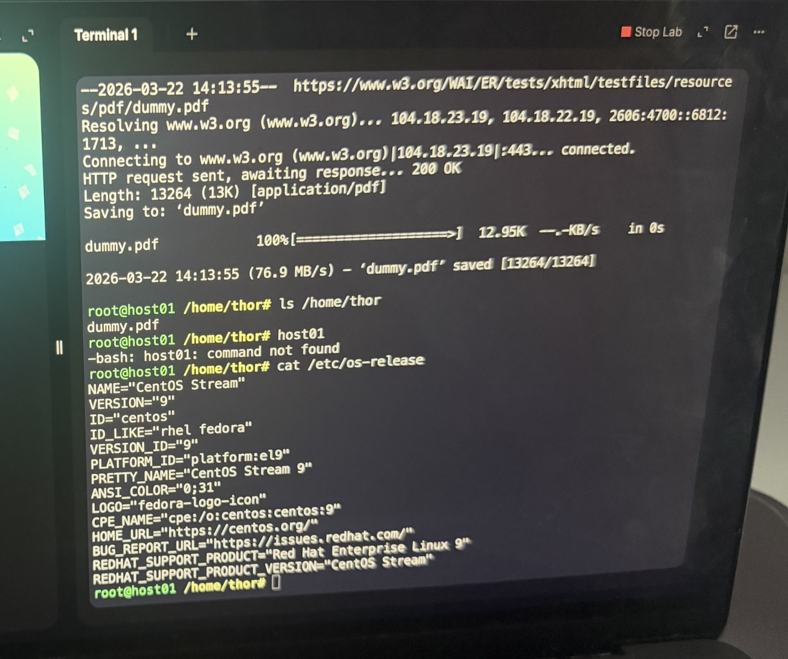

# Linux-notes
Linux fundamentals, commands and labs for cloud engineering
# Linux Notes 🐧

## Overview
This repository contains my Linux fundamentals and hands-on labs while learning cloud engineering.

---

## 🔍 What I Learned

### 1. Checking Current User
```bash
whoami
```

### 2. Getting User ID and Groups
```bash
id
```

### 3. Switching to Root User
```bash
sudo -i
```

---

### 4. Viewing Files in Root Directory
```bash
cd /
ls
```

---

### 5. Checking OS Information
```bash
cat /etc/os-release
```

Output showed:
- OS: CentOS Stream
- Version: 9

---

### 6. Downloading Files from Internet
```bash
cd /home/thor
wget https://www.w3.org/WAI/ER/tests/xhtml/testfiles/resources/pdf/dummy.pdf
```

---

### 7. Verifying Download
```bash
ls /home/thor
```

---

### 8. SSH into Another Server
```bash
ssh thor@172.16.238.3
```

---

## 📸 Lab Evidence

### Root Access & File Check


### File Download & OS Check


---

## 💡 Key Takeaways
- Learned how to identify OS type before installing packages
- Practiced switching users and permissions
- Used wget to download files
- Understood importance of SSH in cloud environments
